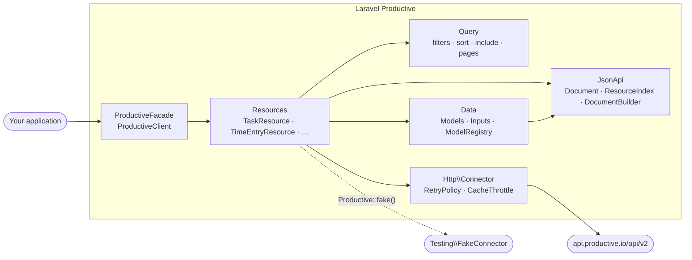

[Back to documentation](README.md)

# Architecture

## Layers

- **Resources** are thin, typed façades over one endpoint group. Every public method maps to exactly one operation in Productive's OpenAPI spec and delegates to the shared helpers in `Resources\Resource`, so request building, pagination and hydration exist in one place.
- **Query** builds and validates query strings. Invalid input fails where it is written, before any request is sent.
- **Data** holds readonly models and inputs. Models read attributes leniently: conversions are lossless and raw values are preserved. Inputs distinguish `Undefined` (not sent) from `null` (cleared).
- **JsonApi** parses and builds JSON:API documents without any Laravel dependency. `ResourceIndex` is an identity map, so included relationships resolve in constant time and cycles are harmless.
- **Http\Connector** is the only class that talks to the HTTP client. It adds credentials, refuses to send them to foreign hosts, maps error statuses to exceptions, retries what is safe to retry and applies the client-side throttle.

## Design rules (enforced by `tests/Arch`)

- Only `Http\Connector` uses the Laravel HTTP client.
- `JsonApi` and `Data` do not depend on Laravel.
- Config, JSON:API objects, models, inputs and HTTP value objects are readonly.
- Models, inputs and resources are final and extend their base class.
- Every exception extends `ProductiveException`, a `RuntimeException`.
- Production code never uses the `Testing` namespace (except the facade's `fake()`).

## Why exceptions instead of nulls

Our observability SDK ([laravel-langfuse](https://github.com/axyr/laravel-langfuse)) logs failures and returns `null`, because tracing must never break the host application. This SDK manages invoices, time and budgets, where a silently ignored failure is a bug. Every failure throws.

## Octane

The config, throttle and client are scoped bindings that reset per request. Resources are created per call and hold no state.

---

Previous: [Testing](testing.md) · Next: [Development](development.md)
